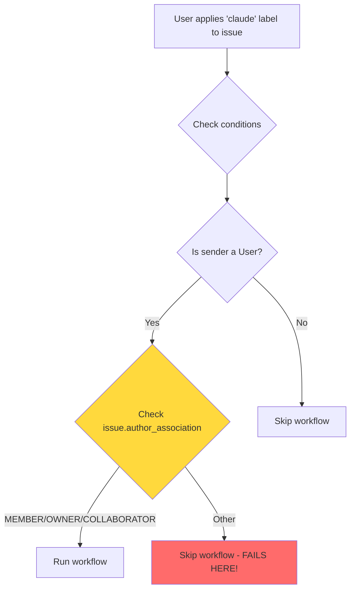
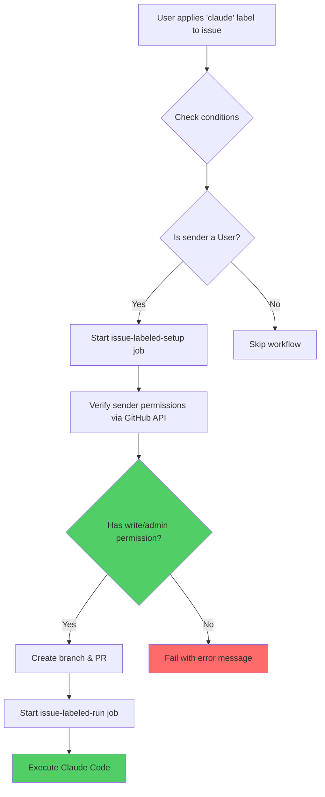

# Claude Workflow Label Trigger - Before & After

## Before (Broken)



**Problem**: Checks the **issue author's** association, not the **label applier's** permissions.

**Example Failure Scenario**:

- Issue created by external contributor (no MEMBER/OWNER/COLLABORATOR association)
- Trusted team member (COLLABORATOR) applies 'claude' label
- Workflow skips because it checks the issue author, not the labeler ❌

---

## After (Fixed)



**Solution**: Explicitly verifies the **label applier** has write or admin permissions using GitHub API.

**Example Success Scenario**:

- Issue created by external contributor (no MEMBER/OWNER/COLLABORATOR association)
- Trusted team member (COLLABORATOR) applies 'claude' label
- Workflow runs because it checks the labeler's permissions via API ✅
- API confirms labeler has write access
- Workflow proceeds successfully

---

## Key Changes

### 1. Removed Incorrect Check

**Before:**

```yaml
if: |
  github.event_name == 'issues' &&
  github.event.action == 'labeled' &&
  github.event.label.name == 'claude' &&
  github.event.sender.type == 'User' &&
  (github.event.issue.author_association == 'MEMBER' ||
   github.event.issue.author_association == 'OWNER' ||
   github.event.issue.author_association == 'COLLABORATOR')  # ❌ Wrong!
```

**After:**

```yaml
if: |
  github.event_name == 'issues' &&
  github.event.action == 'labeled' &&
  github.event.label.name == 'claude' &&
  github.event.sender.type == 'User'  # ✅ Simplified condition
```

### 2. Added Explicit Permission Check

**New step in workflow:**

```yaml
- name: Verify sender permissions
  env:
    GH_TOKEN: ${{ secrets.GITHUB_TOKEN }}
  run: |
    # Query GitHub API for sender's permission level
    PERMISSION=$(gh api /repos/${{ github.repository }}/collaborators/${{ github.event.sender.login }}/permission | jq -r '.permission')

    # Only allow write or admin
    if [[ "$PERMISSION" != "admin" && "$PERMISSION" != "write" ]]; then
      echo "❌ Error: User ${{ github.event.sender.login }} does not have sufficient permissions"
      exit 1
    fi

    echo "✅ Permission check passed: ${{ github.event.sender.login }} has $PERMISSION permission"
```

---

## Security Comparison

| Security Control | Before | After |
| --- | --- | --- |
| Bot prevention | ✅ `sender.type == 'User'` | ✅ `sender.type == 'User'` |
| Permission check | ❌ Checked wrong person | ✅ Explicit API check of labeler |
| GitHub label permissions | ✅ Write access required | ✅ Write access required |
| Branch protection | ✅ Pre-push hooks | ✅ Pre-push hooks |
| Concurrency control | ✅ One run per issue | ✅ One run per issue |
| **Overall** | ⚠️ Broken logic | ✅ **Stronger security** |

---

## Impact

### Before

- ❌ Workflow fails when trusted member labels issue from non-member
- ❌ Inconsistent behavior between different trigger methods
- ❌ Confusing security model (checking wrong person)

### After

- ✅ Workflow runs correctly for any issue/PR when labeled by authorized user
- ✅ Consistent behavior across all trigger methods
- ✅ Clear, explicit security model with API verification
- ✅ Better error messages when permission check fails
